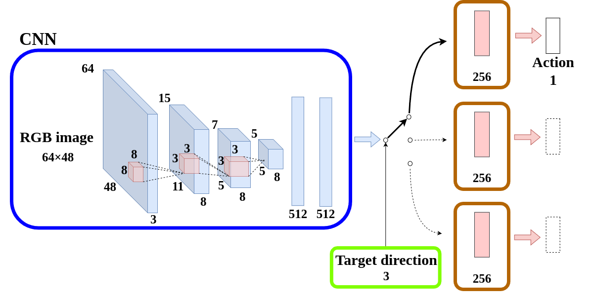

# nav_cloning
深層学習により，カメラ画像と目標方向から，ロボットの角速度を出力するパッケージ

## ネットワーク

- **入力**
  - カメラ画像：64×48
  - 目標方向：直進，左折，右折

- **出力**
  - ロボットの角速度: rad/s

## 構成
- data（dataset, result は初期状態では存在しない）
  - dataset: カメラ画像と目標方向，目標角速度から構成されるデータセット
  - model: 学習機のモデル
  - result: 走行時のデータ
- launch
  - nav_cloning_sim.launch: 根幹となる gazebo や navigation を実行
  - nav_cloning.launch: nav_cloning のノードを実行
  - start_wp.launch: navigation, 学習を開始するサービスを投げる
- scrips
  - learning_node.py: 学習，テストを一括で行うノード
  - network.py: 深層学習機
  - test_node.py: テストのみを行うノード
