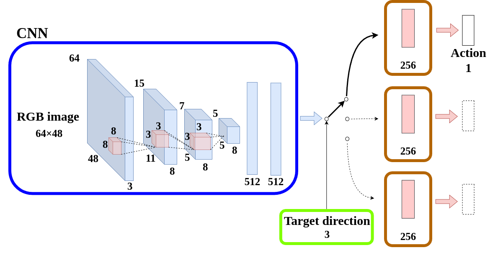

# nav_cloning
深層学習により，カメラ画像と目標方向から，ロボットの角速度を出力するパッケージ

## ネットワーク


- **入力**
  - カメラ画像: 64×48
  - 目標方向: 直進，左折，右折

- **出力**
  - ロボットの角速度: rad/s

## 構成
```
├── CMakeLists.txt
├── README.md
├── data # （dataset, result は初期状態では存在しない）
│   ├── dataset # カメラ画像と目標方向，目標角速度から構成されるデータセット
│   │   ├── dir # 目標方向
│   │   ├── image　# カメラ画像
│   │   └── vel # 目標角速度
│   ├── model # 学習機のモデル
│   │   └── demo
│   │       └── model.pt
│   └── result # 走行時のデータ
├── launch
│   ├── nav_cloning.launch # nav_cloning のノードを実行
│   ├── nav_cloning_sim.launch # 根幹となる gazebo や navigation を実行
│   └── start_wp_nav.launch # navigation, 学習を開始するサービスを投げる
├── network.png
├── package.xml
└── scripts
    ├── learning_node.py # 学習，テストを一括で行うノード
    ├── network.py # 深層学習機
    └── test_node.py # テストのみを行うノード
```